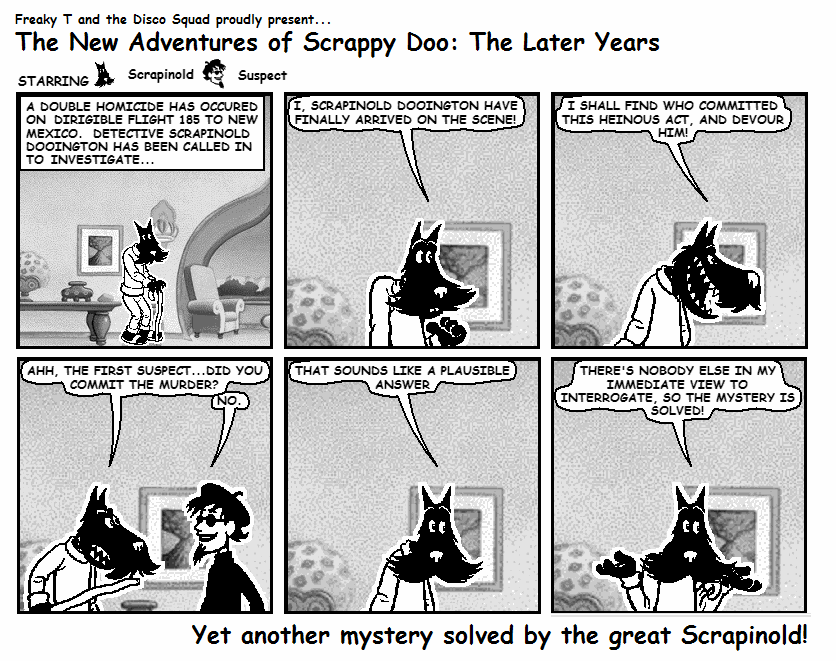
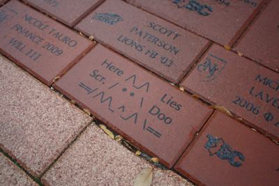

The New Adventures of Scrapinold Dooington is a surrealist comic chronicling the crazy post-retirement adventures of the world-renowned detective Scrapinold Dooington, alongside with a lovable cast of characters.

<h3>History</h3>

  At <a href="http://www.siggraph.org/conferences/siggraph96/core/">SIGGRAPH '96</a>, Microsoft 
  introduced the world to Microsoft Comic Chat 
  (<a href="http://grail.cs.washington.edu/pub/papers/comics.pdf">relevant paper</a>) (<a href="http://www.mermeliz.com/cchat.htm">download link</a>), capable of 
  transforming any mundane IRC chat session into an expertly crafted comic!  (For example, 
  <a href="images/comicChatXkcd.jpg">this image</a>
  was outputted after connecting to #xkcd on irc.foonetic.net.)
   Eleven years later, 
  Mr. Squad and myself came to the conclusion that <a href="http://www.tcnjsignal.net/">our undergraduate college's newspaper</a> would greatly benefit from the addition 
  of a comic by us.  After finding Microsoft Comic Chat, we determined that it could serve as an 
  ideal tool to achieve just such an end.

  
  We thus created the first issue (pictured right),
  in which we see the original versions of both Scrapinold himself, 
  and the "Dude" guy (Prof. Cheese has no equivalent in Comic Chat)  However, both that comic (and a <a href="images/scrapinold2-orig.png">second issue</a>) were both tragically rejected.

  Not to be deterred, however, we created a <a href="/">hand-drawn 
  version of the comic</a>, with the same basic 
  premise and characters.  Unlike its predecessor, it was actually printed!  After the 1 year run of the printed comic, it continues as a webcomic.  Scrapinold has even been immortalized on the 
  College of New Jersey campus, in brick form:

Today, Scrapinold is an open source project, licensed under the <a href="https://creativecommons.org/licenses/by/4.0/">Creative Commons Attribution 4.0 International</a> license! All comic source material is <a href="https://github.com/Scrapinold/scrapinold.github.io">hosted on Github</a>, and we even accept pull requests for new comics!

